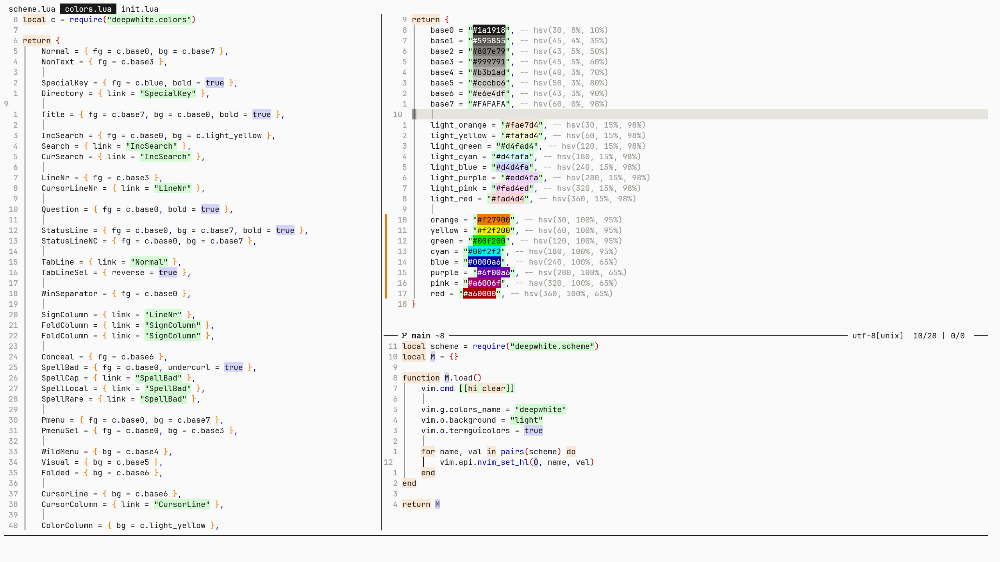

<p align="center">
  <h2 align="center">DeepWhite</h2>
</p>



## About

DeepWhite is a light colorscheme inspired by [flatwhite-syntax](https://github.com/biletskyy/flatwhite-syntax) and [elegant-emacs](https://github.com/rougier/elegant-emacs).

## Installation

```lua
-- for packer.nvim
use {
    'Verf/deepwhite.nvim',
    config = function()
        vim.cmd [[colorscheme deepwhite]]
    end,
}

-- for lazy.nvim
{
    'Verf/deepwhite.nvim',
    lazy = false,
    priority = 1000,
    config = function()
        vim.cmd [[colorscheme deepwhite]]
    end,
}
```

## Configuration

```lua
-- default configuration
require('deepwhite').setup({
    -- If you have some anti-blue light setting (f.lux, light bulb, or low blue light mode monitor),
    -- turn it on, this will set the background color to a cooler color to prevent the background from being too warm.
    low_blue_light = true
})

```

## Q & A

#### Which statusline and tabline are you using?

<details>
<summary>customizd heirline</summary>
    
```lua
{
    'rebelot/heirline.nvim',
    opts = function(_, opts)
        vim.opt.fillchars:append { eob = ' ', stl = '─', stlnc = '─' }
        local conditions = require 'heirline.conditions'
        local utils = require 'heirline.utils'
        local Align = { provider = '%=', hl = 'Normal' }
        local Space = { provider = '───', hl = 'Normal' }
        local Git = {
            condition = conditions.is_git_repo,
            init = function(self)
                self.status_dict = vim.b.gitsigns_status_dict
                self.has_changes = self.status_dict.added ~= 0
                    or self.status_dict.removed ~= 0
                    or self.status_dict.changed ~= 0
            end,
            hl = 'Normal',
            Space,
            { -- git branch name
                provider = function(self)
                    return '  ' .. self.status_dict.head
                end,
                hl = { bold = true },
            },
            {
                provider = function(self)
                    local count = self.status_dict.added or 0
                    return count > 0 and (' +' .. count)
                end,
            },
            {
                provider = function(self)
                    local count = self.status_dict.removed or 0
                    return count > 0 and (' -' .. count)
                end,
            },
            {
                provider = function(self)
                    local count = self.status_dict.changed or 0
                    return count > 0 and (' ~' .. count)
                end,
            },
            {
                condition = function(self)
                    return self.has_changes
                end,
                provider = ' ',
            },
        }
        local FileFormat = {
            provider = function()
                local enc = (vim.bo.fenc ~= '' and vim.bo.fenc) or vim.o.enc
                local fmt = vim.bo.fileformat
                return ' ' .. enc .. '[' .. fmt .. '] '
            end,
            hl = 'Normal',
        }
        local Ruler = {
            provider = ' %l/%L | %c/%-2{virtcol("$") - 1} ',
            hl = 'Normal',
        }
        -- statusline
        local DefaultStatusline = {
            Git,
            Align,
            FileFormat,
            Ruler,
            Space,
        }
        local InactiveStatusline = {
            condition = conditions.is_not_active,
            Align,
        }
        local SpecialStatusline = {
            condition = function()
                return conditions.buffer_matches {
                    buftype = { 'nofile', 'prompt', 'help', 'quickfix' },
                    filetype = { '^git.*', 'fugitive' },
                }
            end,
            Align,
        }
        opts.statusline = {
            fallthrough = false,
            SpecialStatusline,
            InactiveStatusline,
            DefaultStatusline,
        }
        -- tabline
        local TablineFileName = {
            provider = function(self)
                local filename = self.filename
                filename = filename == '' and '[No Name]' or vim.fn.fnamemodify(filename, ':t')
                return filename
            end,
        }
        local TablineFileNameBlock = {
            init = function(self)
                self.filename = vim.api.nvim_buf_get_name(self.bufnr)
            end,
            hl = function(self)
                if self.is_active then
                    return 'TabLineSel'
                else
                    return 'TabLine'
                end
            end,
            { provider = ' ' },
            TablineFileName,
            { provider = ' ' },
        }
        local BufferLine = utils.make_buflist(TablineFileNameBlock)
        local Tabpage = {
            provider = function(self)
                return '%' .. self.tabnr .. 'T ' .. self.tabpage .. ' %T'
            end,
            hl = function(self)
                if not self.is_active then
                    return 'TabLineSel'
                else
                    return 'TabLine'
                end
            end,
        }
        local TabPages = {
            condition = function()
                return #vim.api.nvim_list_tabpages() >= 2
            end,
            utils.make_tablist(Tabpage),
        }
        opts.tabline = { BufferLine, Align, TabPages }
    end,
}
</details>
